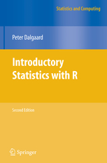
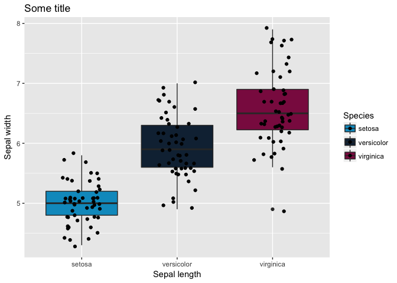

Introduction to R
================

-   [Introduction](#introduction)
    -   [The R interface](#the-r-interface)
    -   [Other software to be used with R](#other-software-to-be-used-with-r)
    -   [Suggested literature](#suggested-literature)
-   [Starting simple with R](#starting-simple-with-r)
-   [Operators](#operators)
-   [The main classes](#the-main-classes)
    -   [Switching between classes](#switching-between-classes)
-   [Objects](#objects)
    -   [Creating objects](#creating-objects)
    -   [Modifying objects](#modifying-objects)
    -   [Modifying objects part 2](#modifying-objects-part-2)
    -   [Switching classes](#switching-classes)
-   [Loading and saving from R](#loading-and-saving-from-r)
    -   [Reading from files](#reading-from-files)
    -   [Save to files](#save-to-files)
-   [Describing data using descriptive statistics](#describing-data-using-descriptive-statistics)
-   [Packages](#packages)
-   [Plotting](#plotting)
    -   [Saving plots](#saving-plots)
-   [More advanced R: creating and running for-loops and functions](#more-advanced-r-creating-and-running-for-loops-and-functions)
-   [Other topics that could be covered](#other-topics-that-could-be-covered)

This page can be found at:
<http://goo.gl/cWAAyv>

<br>

<br>

Introduction
============

The R interface
---------------


<br>

-   Originated from proprietary S programming language (80s) and developed into R (1995)

-   Comes in many flavours, like *R gui* (hardly a user interface), *Rstudio*, *Eclipse*

-   Save scripts as R files, which can be opened with all kinds of software (*R*, *Rstudio*, *Sublime*, *Notepad* etc. )

-   *Annotate scripts*: that means that one uses the hashtag to write in a few lines what is going on in that bit of syntax.

-   **Safer and more reproducible than other software**: source data is not changed, scripts can be shared with others

-   Save objects to \`Rdata files, so you can continue with it next time without the need for rerunning the complete script

-   Above all: it's FREE well maintained software with a large user community in each (scientific) field

<br>

<br>

Other software to be used with R
--------------------------------

-   Rstudio is very useful: <https://www.rstudio.com/products/RStudio/>

It has many advantages: integrated help, use of tab key, more stable than Rgui.

-   Sublime when only typing syntax (to link with servers): <https://www.sublimetext.com/>

-   Packages: for an (almost infinity) number of applications people have developed packages, for example:

CRAN: <https://cran.r-project.org/>

Bioconductor: <http://bioconductor.org/>

-   Git to track your code: www.github.com

<br>

<br>

Suggested literature
--------------------

Google is your best friend. Every question has been asked more than once by someone else!

*The art of R programming, Normal Matlof, Starch Press*


*Introductory Statistics with R, Peter Dalgaard, Springer*



<br>

<br>

Starting simple with R
======================

``` r
1+1
```

    ## [1] 2

``` r
#Assign values to variables
a <- 1
a + a
```

    ## [1] 2

``` r
#But the equal sign also works!
aa = 1
aa+aa
```

    ## [1] 2

``` r
#But professionals use the arrow and not the equal sign to distinguish from  == :)

#Or multiple values or variables
b <- c(1,2,3) # c, concatenate
b
```

    ## [1] 1 2 3

``` r
#Variables can have any names, but don't assign names to existing objects, such as sum, c, sd etc
#Spaces are not allowed as well as special symbols


#Sequences
rep(x = 1,times = 5)
```

    ## [1] 1 1 1 1 1

``` r
seq(from = 1,to = 5, by=0.5)
```

    ## [1] 1.0 1.5 2.0 2.5 3.0 3.5 4.0 4.5 5.0

``` r
seq(from = 1,to = 5, length.out = 100)
```

    ##   [1] 1.000000 1.040404 1.080808 1.121212 1.161616 1.202020 1.242424
    ##   [8] 1.282828 1.323232 1.363636 1.404040 1.444444 1.484848 1.525253
    ##  [15] 1.565657 1.606061 1.646465 1.686869 1.727273 1.767677 1.808081
    ##  [22] 1.848485 1.888889 1.929293 1.969697 2.010101 2.050505 2.090909
    ##  [29] 2.131313 2.171717 2.212121 2.252525 2.292929 2.333333 2.373737
    ##  [36] 2.414141 2.454545 2.494949 2.535354 2.575758 2.616162 2.656566
    ##  [43] 2.696970 2.737374 2.777778 2.818182 2.858586 2.898990 2.939394
    ##  [50] 2.979798 3.020202 3.060606 3.101010 3.141414 3.181818 3.222222
    ##  [57] 3.262626 3.303030 3.343434 3.383838 3.424242 3.464646 3.505051
    ##  [64] 3.545455 3.585859 3.626263 3.666667 3.707071 3.747475 3.787879
    ##  [71] 3.828283 3.868687 3.909091 3.949495 3.989899 4.030303 4.070707
    ##  [78] 4.111111 4.151515 4.191919 4.232323 4.272727 4.313131 4.353535
    ##  [85] 4.393939 4.434343 4.474747 4.515152 4.555556 4.595960 4.636364
    ##  [92] 4.676768 4.717172 4.757576 4.797980 4.838384 4.878788 4.919192
    ##  [99] 4.959596 5.000000

<br>

<br>

Operators
=========

Operators can be used to compare and select on numbers, characters (and sometimes factors)

| Operator | Description                   |
|:---------|:------------------------------|
| +        | Addition                      |
| -        | Substraction                  |
| \*       | Multiplication                |
| /        | Division                      |
| ^        | Exponentiation                |
| %%       | Modulus (7%%3 is 1)           |
| %/%      | Integer division (7%/%3 is 2) |

| Operator  | Description           |
|:----------|:----------------------|
| &lt;      | Less than             |
| &lt;=     | Equal to or less than |
| &gt;      | More than             |
| &gt;=     | Equal to or more than |
| ==        | Equal to              |
| %in%      | Is it in there?       |
| !=        | Not equal to          |
| !x        | Not x                 |
| x|y       | x OR y                |
| x&y       | x AND y               |
| isTRUE(x) | Is X TRUE?            |

``` r
#Examples
3 != 5
```

    ## [1] TRUE

``` r
5 != 5
```

    ## [1] FALSE

``` r
5 == 5
```

    ## [1] TRUE

``` r
#Why would you want that?
#Great for subsetting vectors but also objects!
a <- 1:10
a
```

    ##  [1]  1  2  3  4  5  6  7  8  9 10

``` r
a[a > 5]
```

    ## [1]  6  7  8  9 10

``` r
a[a <= 2]
```

    ## [1] 1 2

``` r
a[a==5]
```

    ## [1] 5

``` r
a %in% 5
```

    ##  [1] FALSE FALSE FALSE FALSE  TRUE FALSE FALSE FALSE FALSE FALSE

``` r
a[a %in% 2]
```

    ## [1] 2

``` r
a[a==3 | a==5]
```

    ## [1] 3 5

<br>

<br>

The main classes
================

-   Numeric and integers
-   Characters
-   Factors
-   Lists

``` r
#Numeric
num <- c(1,2,3)
#Class can be used to view the class
class(num)
```

    ## [1] "numeric"

``` r
#Character
characters <- c("A","B","C")
class(characters)
```

    ## [1] "character"

``` r
#Factor, same as character but with the levels in the data
factors <- factor(c("A","A","B","B","C"), levels=c("A","B","C"))
class(factors)
```

    ## [1] "factor"

``` r
# List 
list(GroupA = 1:3, GroupB = 2:5 , GroupC = 3:5)
```

    ## $GroupA
    ## [1] 1 2 3
    ## 
    ## $GroupB
    ## [1] 2 3 4 5
    ## 
    ## $GroupC
    ## [1] 3 4 5

Switching between classes
-------------------------

You can also convert one class to the other:

``` r
#From character to numeric
a <- c("1","2","3")
class(a)
```

    ## [1] "character"

``` r
head(a)
```

    ## [1] "1" "2" "3"

``` r
b <- as.numeric(a)
class(b)
```

    ## [1] "numeric"

``` r
head(b)
```

    ## [1] 1 2 3

``` r
#From numeric to character
c <- as.character(b)
class(c)
```

    ## [1] "character"

``` r
#From factor to numeric
af <- factor(c("5","6","7"))
# This is not right:
as.numeric(af)
```

    ## [1] 1 2 3

``` r
# But this is:
as.numeric(as.character(af))
```

    ## [1] 5 6 7

<br>

<br>

Objects
=======

Creating objects
----------------

-   Data frames

Advantages: can hold multiple classes, columns can be viewed easily Disadvantage: one cannot do analyses on the entire object

-   Matrices

Advantage: very quick and useful for matrix calculations. Disadvantage: less easy to modify (add columns, change class of data)

``` r
#Data.frame: can hold multiple classes
df <- data.frame(Group = c(1,2,3), Outcome = c(2,3,6))

#head can be used to view objects
head(df)
```

    ##   Group Outcome
    ## 1     1       2
    ## 2     2       3
    ## 3     3       6

``` r
#str will give the classes of the different columns
str(df)
```

    ## 'data.frame':    3 obs. of  2 variables:
    ##  $ Group  : num  1 2 3
    ##  $ Outcome: num  2 3 6

``` r
class(df)
```

    ## [1] "data.frame"

``` r
#Groups can called with the dollar sign (dataframe only)
df$Group
```

    ## [1] 1 2 3

``` r
#Matrix:
mtrx <- matrix(1:25, nrow=5)
head(mtrx)
```

    ##      [,1] [,2] [,3] [,4] [,5]
    ## [1,]    1    6   11   16   21
    ## [2,]    2    7   12   17   22
    ## [3,]    3    8   13   18   23
    ## [4,]    4    9   14   19   24
    ## [5,]    5   10   15   20   25

``` r
str(mtrx)
```

    ##  int [1:5, 1:5] 1 2 3 4 5 6 7 8 9 10 ...

``` r
class(mtrx)
```

    ## [1] "matrix"

``` r
#Calculate something at once
mtrx*mtrx
```

    ##      [,1] [,2] [,3] [,4] [,5]
    ## [1,]    1   36  121  256  441
    ## [2,]    4   49  144  289  484
    ## [3,]    9   64  169  324  529
    ## [4,]   16   81  196  361  576
    ## [5,]   25  100  225  400  625

Modifying objects
-----------------

``` r
#Adding rownames to files 
rownames(df) <- c("A","B","C")
#The file has already colnames
colnames(df)
```

    ## [1] "Group"   "Outcome"

``` r
#What doesn't work:
#rownames(mtrx) <- c("A","B","C")
#Why not?
## Learn to understand error codes (read them carefully)
## If you don't get the error, google it. There is ALWAYS someone before you who had the same question.
## This does work. Why?
rownames(mtrx) <- c("A","B","C","D","E")
```

Modifying objects part 2
------------------------

If the comma is on the right of the indices so \[1:2,\] then it is applied to the *rows*

If the comma is on the left of the indices so \[,1:2\] then it is applied on the *columns*

``` r
#Data.frame
df[1:2, ] #First two lines
```

    ##   Group Outcome
    ## A     1       2
    ## B     2       3

``` r
df[,1:2]
```

    ##   Group Outcome
    ## A     1       2
    ## B     2       3
    ## C     3       6

``` r
df[df$Group == 1,]
```

    ##   Group Outcome
    ## A     1       2

``` r
#Different (order has changed!)
df[2:1, ] 
```

    ##   Group Outcome
    ## B     2       3
    ## A     1       2

``` r
#You can also subset by rownames
df[c("A","B"),]
```

    ##   Group Outcome
    ## A     1       2
    ## B     2       3

``` r
#Or colnames
df[,c("Group","Outcome")]
```

    ##   Group Outcome
    ## A     1       2
    ## B     2       3
    ## C     3       6

``` r
#Subset using operators
df[df$Group ==1,]
```

    ##   Group Outcome
    ## A     1       2

``` r
df[df$Group >= 2,]
```

    ##   Group Outcome
    ## B     2       3
    ## C     3       6

``` r
df[df$Group != 1,]
```

    ##   Group Outcome
    ## B     2       3
    ## C     3       6

``` r
df[rownames(df) != "A",]
```

    ##   Group Outcome
    ## B     2       3
    ## C     3       6

``` r
#Add new columns
df$NewCol <- c(1,2,5)
head(df)
```

    ##   Group Outcome NewCol
    ## A     1       2      1
    ## B     2       3      2
    ## C     3       6      5

``` r
# Modifying a matrix:
mtrx[1:2,]
```

    ##   [,1] [,2] [,3] [,4] [,5]
    ## A    1    6   11   16   21
    ## B    2    7   12   17   22

``` r
mtrx[1:2] #Different!
```

    ## [1] 1 2

Switching classes
-----------------

``` r
#From matrix to dataframe
dfm <- as.data.frame(mtrx)

#From dataframe to matrix
dm <- as.matrix(dfm) #Will convert all columns to 1 class, likely character!
```

<br>

<br>

Loading and saving from R
=========================

Reading from files
------------------

R can read all types of files (with or without required packages), such as txt, csv, xlsx (package: xlsx), sav spss file (package: Hmisc)

``` r
# Setting a working directory (= tell R where to find files and where to save files.)
setwd("/Users/roderick/Documents/Onderwijs/IntroR/")

#Reading csv files (comma delimited)
IrisCSV <- read.table("Iris.csv", sep=",", header=T)

#Or we give the full path
IrisCSV <- read.table("/Users/roderick/Documents/Onderwijs/IntroR/Iris.csv", sep=",", header=T)

head(IrisCSV)
```

    ##   Sepal.Length Sepal.Width Petal.Length Petal.Width Species
    ## 1          5.1         3.5          1.4         0.2  setosa
    ## 2          4.9         3.0          1.4         0.2  setosa
    ## 3          4.7         3.2          1.3         0.2  setosa
    ## 4          4.6         3.1          1.5         0.2  setosa
    ## 5          5.0         3.6          1.4         0.2  setosa
    ## 6          5.4         3.9          1.7         0.4  setosa

``` r
str(IrisCSV)
```

    ## 'data.frame':    150 obs. of  5 variables:
    ##  $ Sepal.Length: num  5.1 4.9 4.7 4.6 5 5.4 4.6 5 4.4 4.9 ...
    ##  $ Sepal.Width : num  3.5 3 3.2 3.1 3.6 3.9 3.4 3.4 2.9 3.1 ...
    ##  $ Petal.Length: num  1.4 1.4 1.3 1.5 1.4 1.7 1.4 1.5 1.4 1.5 ...
    ##  $ Petal.Width : num  0.2 0.2 0.2 0.2 0.2 0.4 0.3 0.2 0.2 0.1 ...
    ##  $ Species     : Factor w/ 3 levels "setosa","versicolor",..: 1 1 1 1 1 1 1 1 1 1 ...

``` r
#Reading tab delimited 
IrisTXT <- read.table("Iris as text file.txt", sep="\t", header=T)
head(IrisTXT)
```

    ##   Sepal.Length Sepal.Width Petal.Length Petal.Width Species
    ## 1          5.1         3.5          1.4         0.2  setosa
    ## 2          4.9         3.0          1.4         0.2  setosa
    ## 3          4.7         3.2          1.3         0.2  setosa
    ## 4          4.6         3.1          1.5         0.2  setosa
    ## 5          5.0         3.6          1.4         0.2  setosa
    ## 6          5.4         3.9          1.7         0.4  setosa

``` r
str(IrisTXT)
```

    ## 'data.frame':    150 obs. of  5 variables:
    ##  $ Sepal.Length: num  5.1 4.9 4.7 4.6 5 5.4 4.6 5 4.4 4.9 ...
    ##  $ Sepal.Width : num  3.5 3 3.2 3.1 3.6 3.9 3.4 3.4 2.9 3.1 ...
    ##  $ Petal.Length: num  1.4 1.4 1.3 1.5 1.4 1.7 1.4 1.5 1.4 1.5 ...
    ##  $ Petal.Width : num  0.2 0.2 0.2 0.2 0.2 0.4 0.3 0.2 0.2 0.1 ...
    ##  $ Species     : Factor w/ 3 levels "setosa","versicolor",..: 1 1 1 1 1 1 1 1 1 1 ...

Save to files
-------------

``` r
data(iris)

# Save objects in analysis
save(iris, file="Iris.RData")
# Load objects from previous sessions
load("Iris.RData")

#One can also save to common formats such as csv, txt
write.table(iris, file="Iris as text file.txt", sep="\t", col.names=T, row.names=F)
write.table(iris, file="Iris as csv file.csv", sep=";", col.names=T, row.names=F)
```

Describing data using descriptive statistics
============================================

``` r
#The iris dataset is a build in dataset

#Describe dataset
nrow(iris)
```

    ## [1] 150

``` r
ncol(iris)
```

    ## [1] 5

``` r
length(iris$Sepal.Length)
```

    ## [1] 150

``` r
sum(iris$Sepal.Length)
```

    ## [1] 876.5

``` r
mean(iris$Sepal.Length)
```

    ## [1] 5.843333

``` r
median(iris$Sepal.Length)
```

    ## [1] 5.8

``` r
sd(iris$Sepal.Length)
```

    ## [1] 0.8280661

``` r
# Summary statistics by group
# by(data = someVariable, INDICES = someGrouping, FUN = aGroupingFunction)

by(data = iris$Sepal.Length, INDICES = iris$Species, mean)
```

    ## iris$Species: setosa
    ## [1] 5.006
    ## -------------------------------------------------------- 
    ## iris$Species: versicolor
    ## [1] 5.936
    ## -------------------------------------------------------- 
    ## iris$Species: virginica
    ## [1] 6.588

``` r
# Same as:
by(iris$Sepal.Length, iris$Species, mean)
```

    ## iris$Species: setosa
    ## [1] 5.006
    ## -------------------------------------------------------- 
    ## iris$Species: versicolor
    ## [1] 5.936
    ## -------------------------------------------------------- 
    ## iris$Species: virginica
    ## [1] 6.588

``` r
#Store in variable
meanGroup <- by(data = iris$Sepal.Length, INDICES = iris$Species, FUN = mean)
SDGroup <- by(data = iris$Sepal.Length, INDICES = iris$Species, FUN = sd)
LengthGroup <- by(data = iris$Sepal.Length, INDICES = iris$Species, FUN = length)

class(meanGroup)
```

    ## [1] "by"

``` r
#Small trick:
as.list(meanGroup)
```

    ## $setosa
    ## [1] 5.006
    ## 
    ## $versicolor
    ## [1] 5.936
    ## 
    ## $virginica
    ## [1] 6.588

``` r
statistics <- cbind( as.list(meanGroup),as.list(SDGroup), as.list(LengthGroup))
colnames(statistics) <- c("Mean","SD","n")
statistics
```

    ##            Mean  SD        n 
    ## setosa     5.006 0.3524897 50
    ## versicolor 5.936 0.5161711 50
    ## virginica  6.588 0.6358796 50

<br>

<br>

Packages
========

Packages are an infinite rich source to facilitate your analysis

*To install packages from CRAN*

`install.packages("ggplot2")`

*Or when from Bioconductor:*

`source("https://bioconductor.org/biocLite.R")`

`biocLite("IRanges")`

<br>

<br>

Plotting
========

R base (without packages) can plot all kind of plots but are not very nice.

ggplot2 is a very commonly used package for plotting. Although the approach is a bit different, the plots are nicer and more flexible to change. For more help see: <http://ggplot2.tidyverse.org/reference/> or google!

``` r
library(ggplot2)

#Scatter plot
plot(iris$Sepal.Length, iris$Sepal.Width, xlab="Sepal length", ylab="Sepal width")
```


``` r
ggplot(iris, aes(x=Sepal.Length, y=Sepal.Width, col=Species))+ # Define variables
  geom_point()+ # We want to plot dots
  ggtitle("Some title")+ #Add title to graph
  xlab("Sepal length")+ #Add x-axis labels
  ylab("Sepal width")+ #Add y-axis labels
  scale_color_manual(values = c("#009AC7","#132B41","#8B1A4F"))
```


``` r
# Boxplot
boxplot(iris$Sepal.Length~iris$Species, xlab="Sepal length", ylab="Sepal width")
```


``` r
ggplot(iris, aes(x=Species, y=Sepal.Length, fill=Species))+ #Define variables
  geom_boxplot()+ #What kind of graph?
  ggtitle("Some title")+ #Add title to graph
  xlab("Sepal length")+ #Add x-axis labels
  ylab("Sepal width")+ #Add y-axis labels
  scale_fill_manual(values = c("#009AC7","#132B41","#8B1A4F")) # Change colors using HEX colors
```


``` r
# Jitter plot
ggplot(iris, aes(x=Species, y=Sepal.Length, col=Species))+ #Define variables
  geom_jitter(width=0.2)+
  ggtitle("Some title")+ 
  xlab("Sepal length")+ 
  ylab("Sepal width")+ 
  scale_colour_manual(values = c("#009AC7","#132B41","#8B1A4F")) 
```


``` r
# Smoothed line graph
ggplot(iris, aes(x=Sepal.Width, y=Sepal.Length, col=Species))+
  geom_point()+
  geom_smooth(method=lm)+
  ggtitle("Some title")+
  xlab("Sepal length")+
  ylab("Sepal width")+
  scale_color_manual(values = c("#009AC7","#132B41","#8B1A4F"))
```


``` r
ggplot(iris, aes(x=Sepal.Width, y=Sepal.Length, col=Species))+
  geom_point()+
  geom_smooth(method=loess)+
  ggtitle("Some title")+
  xlab("Sepal length")+
  ylab("Sepal width")+
  scale_color_manual(values = c("#009AC7","#132B41","#8B1A4F"))
```


``` r
#One can also different types of plots on top of each other
ggplot(iris, aes(x=Species, y=Sepal.Length, fill=Species))+ #Define variables
  geom_boxplot()+ #What kind of graph?
  geom_jitter(width=0.2)+
  ggtitle("Some title")+ #Add title to graph
  xlab("Sepal length")+ #Add x-axis labels
  ylab("Sepal width")+ #Add y-axis labels
  scale_fill_manual(values = c("#009AC7","#132B41","#8B1A4F")) # Change colors using HEX colors
```



Saving plots
------------

``` r
library(ggplot2)

pdf("Boxplot of iris data.pdf")
ggplot(iris, aes(x=Species, y=Sepal.Length, fill=Species))+ #Define variables
  geom_boxplot()+ #What kind of graph?
  ggtitle("Some title")+ #Add title to graph
  xlab("Sepal length")+ #Add x-axis labels
  ylab("Sepal width")+ #Add y-axis labels
  scale_fill_manual(values = c("#009AC7","#132B41","#8B1A4F")) # Change colors using HEX colors
dev.off()
```

    ## quartz_off_screen 
    ##                 2

``` r
jpeg("Boxplot of iris data.jpg", width = 10, height = 10, units="cm", res=200)
ggplot(iris, aes(x=Species, y=Sepal.Length, fill=Species))+ #Define variables
  geom_boxplot()+ #What kind of graph?
  ggtitle("Some title")+ #Add title to graph
  xlab("Sepal length")+ #Add x-axis labels
  ylab("Sepal width")+ #Add y-axis labels
  scale_fill_manual(values = c("#009AC7","#132B41","#8B1A4F")) # Change colors using HEX colors
dev.off()
```

    ## quartz_off_screen 
    ##                 2

More advanced R: creating and running for-loops and functions
=============================================================

A function can replicate the same thing over and over for multiple columns to reduce the amount of work and reduce errors. We use the `EuStockMarkets` dataset

``` r
data("EuStockMarkets")

# We want the characteristics for each row 
getSummary <- function(col, Data)
{
  co <- colnames(Data)[col]
  me <- mean(Data[,col])
  sdv <- sd(Data[,col])
  #Now we create a dataset to give everything back
  out <- data.frame(Group = co, Mean = me, SD=sdv)
  out
}

getSummary(col = 1, Data=EuStockMarkets)
```

    ##   Group     Mean       SD
    ## 1   DAX 2530.657 1084.793

``` r
#But now for all
dim(EuStockMarkets)
```

    ## [1] 1860    4

``` r
res <- lapply(1:4, getSummary, Data=EuStockMarkets)
newTable <- do.call(rbind, res)
newTable
```

    ##   Group     Mean        SD
    ## 1   DAX 2530.657 1084.7927
    ## 2   SMI 3376.224 1663.0265
    ## 3   CAC 2227.828  580.3142
    ## 4  FTSE 3565.643  976.7155

<br>

<br>

Other topics that could be covered
==================================

-   If/else statements
-   Writing functions
-   For-loops
-   Else?
