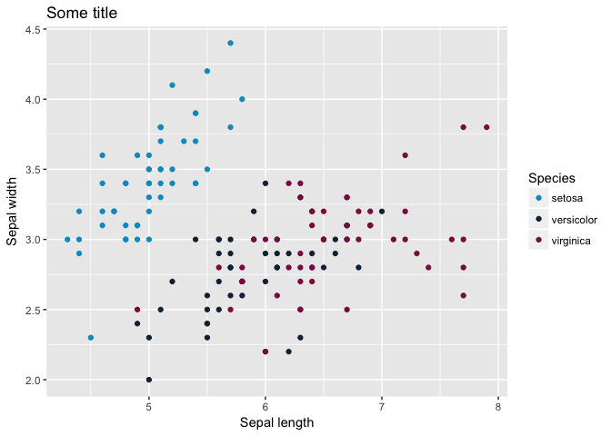
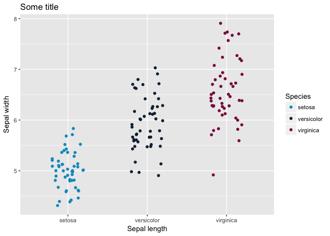

Introduction to R
================
R.Slieker

Where to get this page from:
----------------------------

<http://goo.gl/cWAAyv>

Introduction
------------

The R interface
---------------

-   Originated from proprietary S programming language

-   Comes in many flavours, like GUI (hardly a user interface), Rstudio, Eclipse

-   Save scripts as R files, can be opened with all kinds of software (R, Rstudio, sublime, Notepad etc. )

-   Save objects to Rdata files, so you can continue with it next time without the need for rerunning the complete script

Other software to be used with R
--------------------------------

-   Rstudio is very useful: <https://www.rstudio.com/products/RStudio/>

It has many advantages: integrated help, use of tab key, more stable than Rgui.

-   Sublime when only typing syntax (to link with servers): <https://www.sublimetext.com/>

-   Packages: for an (almost infinity) number of applications people have developed packages, for example Bioconductor: <http://bioconductor.org/>

-   Git to track your code: <https://git.lumc.nl>

Suggested literature:
---------------------

*The art of R programming, Normal Matlof, Starch Press*

*Introductory Statistics with R, Peter Dalgaard, Springer*

Starting simple with R
----------------------

``` r
1+1
```

    ## [1] 2

``` r
#Assign values to variables
a <- 1
a + a
```

    ## [1] 2

``` r
#But the equal sign also works!
aa = 1
aa+aa
```

    ## [1] 2

``` r
#But professionals use the arrow and not the equal sign to distinguish from  == :)

#Or multiple values ot variables
b <- c(1,2,3) # c, concatenate
b
```

    ## [1] 1 2 3

``` r
#Variables can have any names, but don't assign names to existing objects, such as sum, c, sd etc
#Spaces are not allowed as well as special symbols


#Sequences
rep(x = 1,times = 5)
```

    ## [1] 1 1 1 1 1

``` r
seq(from = 1,to = 5,by=0.5)
```

    ## [1] 1.0 1.5 2.0 2.5 3.0 3.5 4.0 4.5 5.0

The main classes
----------------

-   Numeric and integers
-   Characters
-   Factors
-   Lists

``` r
#Numeric
num <- c(1,2,3)
#Class can be used to view the classs
class(num)
```

    ## [1] "numeric"

``` r
#Character
characters <- c("A","B","C")
class(characters)
```

    ## [1] "character"

``` r
#Factor, same as character but with the levels in the data
factors <- factor(c("A","A","B","B","C"), levels=c("A","B","C"))
class(factors)
```

    ## [1] "factor"

``` r
# List 
list(GroupA = 1:3, GroupB = 2:5 , GroupC = 3:5)
```

    ## $GroupA
    ## [1] 1 2 3
    ## 
    ## $GroupB
    ## [1] 2 3 4 5
    ## 
    ## $GroupC
    ## [1] 3 4 5

Objects
-------

-   Data frames

Advantages: can hold multiple classes, columns can be viewed easily Disadvantage: one cannot do analyses on the entire object

-   Matrices

Advantage: very quick and useful for matrix calculations. Disadvantage: less easy to modify (add columns, change class of data)

``` r
#Data.frame: can hold multiple classes
df <- data.frame(Group = c(1,2,3), Outcome = c(2,3,6))

#head can be used to view objects
head(df)
```

    ##   Group Outcome
    ## 1     1       2
    ## 2     2       3
    ## 3     3       6

``` r
#str will give the classes of the different columns
str(df)
```

    ## 'data.frame':    3 obs. of  2 variables:
    ##  $ Group  : num  1 2 3
    ##  $ Outcome: num  2 3 6

``` r
class(df)
```

    ## [1] "data.frame"

``` r
#Groups can called with the dollar sign (dataframe only)
df$Group
```

    ## [1] 1 2 3

``` r
#Matrix:
mtrx <- matrix(1:25, nrow=5)
head(mtrx)
```

    ##      [,1] [,2] [,3] [,4] [,5]
    ## [1,]    1    6   11   16   21
    ## [2,]    2    7   12   17   22
    ## [3,]    3    8   13   18   23
    ## [4,]    4    9   14   19   24
    ## [5,]    5   10   15   20   25

``` r
str(mtrx)
```

    ##  int [1:5, 1:5] 1 2 3 4 5 6 7 8 9 10 ...

``` r
class(mtrx)
```

    ## [1] "matrix"

``` r
#Calculate something at once
mtrx*mtrx
```

    ##      [,1] [,2] [,3] [,4] [,5]
    ## [1,]    1   36  121  256  441
    ## [2,]    4   49  144  289  484
    ## [3,]    9   64  169  324  529
    ## [4,]   16   81  196  361  576
    ## [5,]   25  100  225  400  625

Modifying objects
-----------------

``` r
#Adding rownames to files 
rownames(df) <- c("A","B","C")
#The file has already colnames
colnames(df)
```

    ## [1] "Group"   "Outcome"

``` r
#What doesn't work:
#rownames(mtrx) <- c("A","B","C")
#Why not?
## Learn to understand error codes (read them carefully)
## If you don't get the error, google it. There is ALWAYS someone before you who had the same question.
## This does work. Why?
rownames(mtrx) <- c("A","B","C","D","E")


#Modifying objects

#Data.frame
df[1:2, ] #First two lines
```

    ##   Group Outcome
    ## A     1       2
    ## B     2       3

``` r
#Different (order has changed!)
df[2:1, ] 
```

    ##   Group Outcome
    ## B     2       3
    ## A     1       2

``` r
#You can also subset by rownames
df[c("A","B"),]
```

    ##   Group Outcome
    ## A     1       2
    ## B     2       3

``` r
#Or colnames
df[,c("Group","Outcome")]
```

    ##   Group Outcome
    ## A     1       2
    ## B     2       3
    ## C     3       6

``` r
#Add new columns
df$NewCol <- c(1,2,5)
head(df)
```

    ##   Group Outcome NewCol
    ## A     1       2      1
    ## B     2       3      2
    ## C     3       6      5

``` r
# Modifying a matrix:
mtrx[1:2,]
```

    ##   [,1] [,2] [,3] [,4] [,5]
    ## A    1    6   11   16   21
    ## B    2    7   12   17   22

``` r
mtrx[1:2] #Different!
```

    ## [1] 1 2

Reading from files
------------------

R can read all types of files (with or without required packages), such as txt, csv, xlsx (package: xlsx), sav spss file (package: Hmisc)

``` r
# Setting a working directory (= tell R where to find files and where to save files.)
setwd("/Users/roderick/Documents/Onderwijs/IntroR/")

#Reading csv files (comma delimited)
IrisCSV <- read.table("Iris.csv", sep=",", header=T)

#Or we give the full path
IrisCSV <- read.table("/Users/roderick/Documents/Onderwijs/IntroR/Iris.csv", sep=",", header=T)

head(IrisCSV)
```

    ##   Sepal.Length Sepal.Width Petal.Length Petal.Width Species
    ## 1          5.1         3.5          1.4         0.2  setosa
    ## 2          4.9         3.0          1.4         0.2  setosa
    ## 3          4.7         3.2          1.3         0.2  setosa
    ## 4          4.6         3.1          1.5         0.2  setosa
    ## 5          5.0         3.6          1.4         0.2  setosa
    ## 6          5.4         3.9          1.7         0.4  setosa

``` r
str(IrisCSV)
```

    ## 'data.frame':    150 obs. of  5 variables:
    ##  $ Sepal.Length: num  5.1 4.9 4.7 4.6 5 5.4 4.6 5 4.4 4.9 ...
    ##  $ Sepal.Width : num  3.5 3 3.2 3.1 3.6 3.9 3.4 3.4 2.9 3.1 ...
    ##  $ Petal.Length: num  1.4 1.4 1.3 1.5 1.4 1.7 1.4 1.5 1.4 1.5 ...
    ##  $ Petal.Width : num  0.2 0.2 0.2 0.2 0.2 0.4 0.3 0.2 0.2 0.1 ...
    ##  $ Species     : Factor w/ 3 levels "setosa","versicolor",..: 1 1 1 1 1 1 1 1 1 1 ...

``` r
#Reading tab delimited 
IrisTXT <- read.table("Iris.txt", sep="\t", header=T)
head(IrisTXT)
```

    ##   Sepal.Length Sepal.Width Petal.Length Petal.Width Species
    ## 1          5.1         3.5          1.4         0.2  setosa
    ## 2          4.9         3.0          1.4         0.2  setosa
    ## 3          4.7         3.2          1.3         0.2  setosa
    ## 4          4.6         3.1          1.5         0.2  setosa
    ## 5          5.0         3.6          1.4         0.2  setosa
    ## 6          5.4         3.9          1.7         0.4  setosa

``` r
str(IrisTXT)
```

    ## 'data.frame':    150 obs. of  5 variables:
    ##  $ Sepal.Length: num  5.1 4.9 4.7 4.6 5 5.4 4.6 5 4.4 4.9 ...
    ##  $ Sepal.Width : num  3.5 3 3.2 3.1 3.6 3.9 3.4 3.4 2.9 3.1 ...
    ##  $ Petal.Length: num  1.4 1.4 1.3 1.5 1.4 1.7 1.4 1.5 1.4 1.5 ...
    ##  $ Petal.Width : num  0.2 0.2 0.2 0.2 0.2 0.4 0.3 0.2 0.2 0.1 ...
    ##  $ Species     : Factor w/ 3 levels "setosa","versicolor",..: 1 1 1 1 1 1 1 1 1 1 ...

Summary statistics
------------------

There are various ways of calcalating summary statistics. A useful function is **by**.

``` r
#The iris dataset is a build in dataset
data(iris)

#Describe dataset
nrow(iris)
```

    ## [1] 150

``` r
ncol(iris)
```

    ## [1] 5

``` r
length(iris$Sepal.Length)
```

    ## [1] 150

``` r
sum(iris$Sepal.Length)
```

    ## [1] 876.5

``` r
mean(iris$Sepal.Length)
```

    ## [1] 5.843333

``` r
sd(iris$Sepal.Length)
```

    ## [1] 0.8280661

``` r
# Summary statistics by group
# by(data = someVariable, INDICES = someGrouping, FUN = aGroupingFunction)

by(data = iris$Sepal.Length, INDICES = iris$Species, mean)
```

    ## iris$Species: setosa
    ## [1] 5.006
    ## -------------------------------------------------------- 
    ## iris$Species: versicolor
    ## [1] 5.936
    ## -------------------------------------------------------- 
    ## iris$Species: virginica
    ## [1] 6.588

``` r
# Same as:
by(iris$Sepal.Length, iris$Species, mean)
```

    ## iris$Species: setosa
    ## [1] 5.006
    ## -------------------------------------------------------- 
    ## iris$Species: versicolor
    ## [1] 5.936
    ## -------------------------------------------------------- 
    ## iris$Species: virginica
    ## [1] 6.588

``` r
#Store in variable
meanGroup <- by(data = iris$Sepal.Length, INDICES = iris$Species, FUN = mean)
SDGroup <- by(data = iris$Sepal.Length, INDICES = iris$Species, FUN = sd)
LengthGroup <- by(data = iris$Sepal.Length, INDICES = iris$Species, FUN = length)

class(meanGroup)
```

    ## [1] "by"

``` r
#Small trick:
as.list(meanGroup)
```

    ## $setosa
    ## [1] 5.006
    ## 
    ## $versicolor
    ## [1] 5.936
    ## 
    ## $virginica
    ## [1] 6.588

``` r
statistics <- cbind( as.list(meanGroup),as.list(SDGroup), as.list(LengthGroup))
colnames(statistics) <- c("Mean","SD","n")
statistics
```

    ##            Mean  SD        n 
    ## setosa     5.006 0.3524897 50
    ## versicolor 5.936 0.5161711 50
    ## virginica  6.588 0.6358796 50

Packages
--------

Packages are an infinite rich source to facilitate your analysis

*To install packages from CRAN*

install.packages("ggplot2")

*Or when from Bioconductor:*

source("<https://bioconductor.org/biocLite.R>")

biocLite("IRanges")

Plotting
--------

R base (without packages) can plot all kind of plots

``` r
library(ggplot2)

#Scatter plot
plot(IrisCSV$Sepal.Length, IrisCSV$Sepal.Width, xlab="Sepal length", ylab="Sepal width")
```


``` r
ggplot(IrisCSV, aes(x=Sepal.Length, y=Sepal.Width, col=Species))+
  geom_point()+
  ggtitle("Some title")+
  xlab("Sepal length")+
  ylab("Sepal width")+
  scale_color_manual(values = c("#009AC7","#132B41","#8B1A4F"))
```



``` r
# Boxplot
boxplot(IrisCSV$Sepal.Length~IrisCSV$Species, xlab="Sepal length", ylab="Sepal width")
```


``` r
ggplot(IrisCSV, aes(x=Species, y=Sepal.Length, fill=Species))+ #Define variables
  geom_boxplot()+ #What kind of graph?
  ggtitle("Some title")+ #Add title to graph
  xlab("Sepal length")+ #Add x-axis labels
  ylab("Sepal width")+ #Add y-axis labels
  scale_fill_manual(values = c("#009AC7","#132B41","#8B1A4F")) # Change colors using HEX colors
```


``` r
# Smoothed line graph
ggplot(IrisCSV, aes(x=Sepal.Width, y=Sepal.Length, col=Species))+
  geom_point()+
  geom_smooth(method=lm)+
  ggtitle("Some title")+
  xlab("Sepal length")+
  ylab("Sepal width")+
  scale_color_manual(values = c("#009AC7","#132B41","#8B1A4F"))
```



``` r
ggplot(IrisCSV, aes(x=Sepal.Width, y=Sepal.Length, col=Species))+
  geom_point()+
  geom_smooth(method=loess)+
  ggtitle("Some title")+
  xlab("Sepal length")+
  ylab("Sepal width")+
  scale_color_manual(values = c("#009AC7","#132B41","#8B1A4F"))
```


